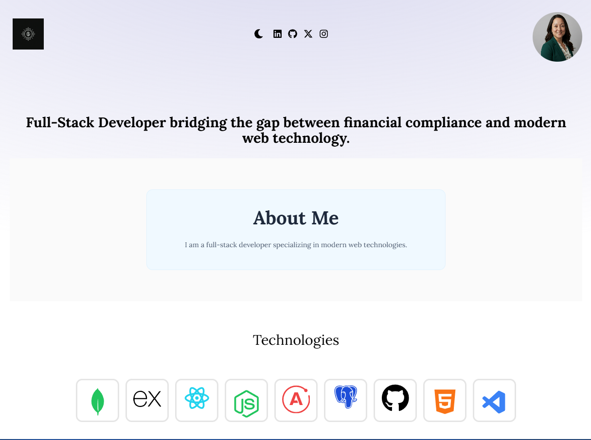
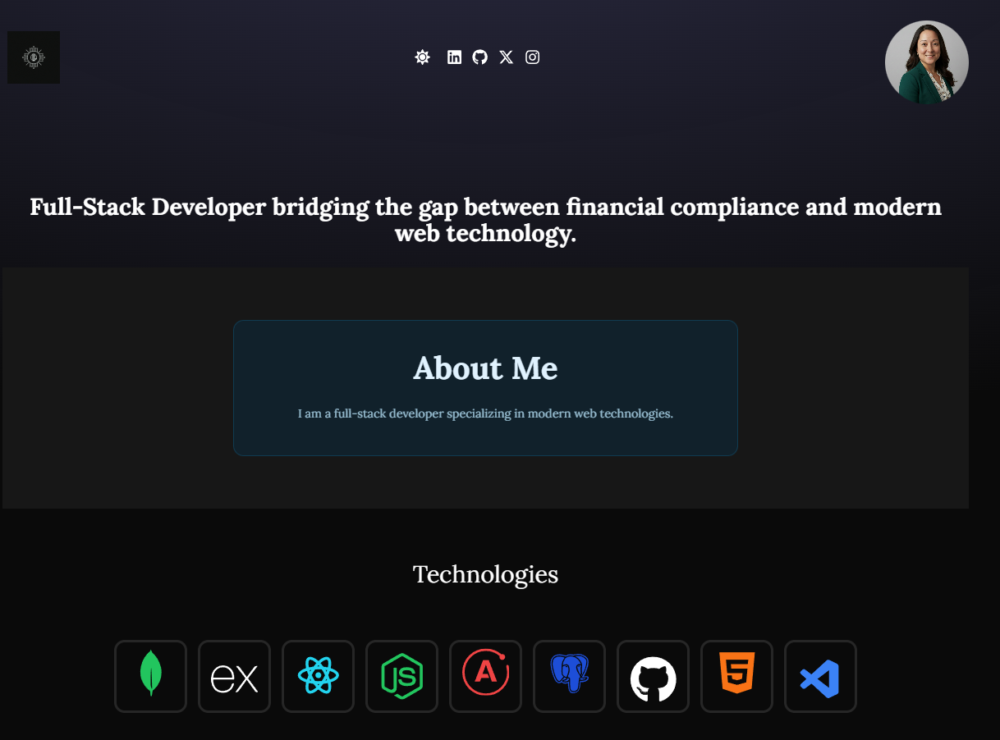
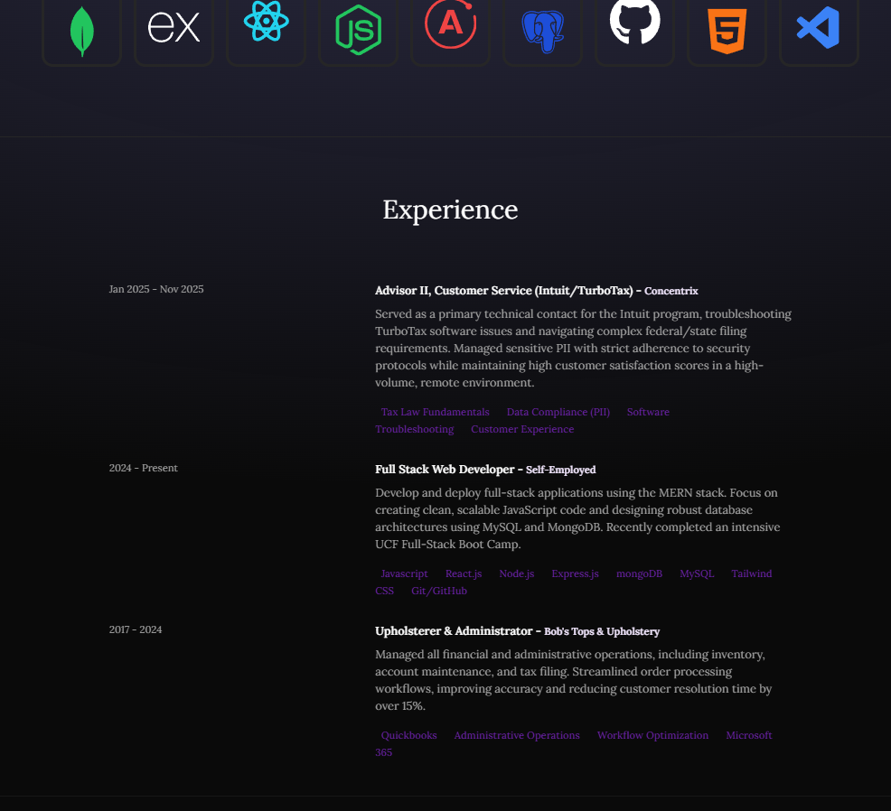

# ljlainio-react-vite

# React Challenge: React Portfolio  (Mod #20)

# React + Vite + Netlify

Utilizing open-source to create this personal profile for myself.

This template provides a minimal setup to get React working in Vite with HMR and some ESLint rules.

Currently, two official plugins are available:

- [@vitejs/plugin-react](https://github.com/vitejs/vite-plugin-react/blob/main/packages/plugin-react/README.md) uses [Babel](https://babeljs.io/) for Fast Refresh
- [@vitejs/plugin-react-swc](https://github.com/vitejs/vite-plugin-react-swc) uses [SWC](https://swc.rs/) for Fast Refresh

I want to document and note that I used the directions from:
https://github.com/kushald/react-portfolio-assets-kevin

following along with his youtube.com tutorial:
https://www.youtube.com/watch?v=_63mEm3AMSY&ab_channel=compiletab

## Table of Contents

 * [Description](#description)

 * [Mock-up](#mock-up)

 * [Live-URL-of-Deployed-Application](#live-url-of-deployed-application)

 * [Live-Screen-Recording-of-Application-Functionality](#live-screen-recording-of-application-functionality)

 * [Screenshots](#screenshots)

 * [Technologies-Used](#technologies-used)

 * [Credits](#credits)

 * [Features](#features)

 * [Usage-Information](#usage-information)

 * [Contribution-Guidelines](#contribution-guidelines)

 * [Test-Instructions](#test-instructions)

 * [License](#license)

 * [Questions](#questions)

## Description

🚀 Hello World, I'm Lora Lainio 👋

**Full-Stack Developer | Data Security & Tax Professional (PTIN)**

I bridge the gap between complex financial compliance and modern web technology, bringing a security-first mindset from my tax preparation background to every line of code I write.

🛡️ Secure Development Philosophy

- **Data Integrity:** Security-first mindset from tax preparation ensures robust, compliant applications.
- **Empathy in Design:** Building with accessibility for all users, making technology inclusive and user-friendly.

My journey combines financial expertise with cutting-edge web development, creating solutions that are not only functional but also secure and accessible.

As a web developer, I understand the importance of being part of a community. I need a platform to showcase my projects, not just for job applications or freelance work, but also to collaborate with fellow developers and share my work.

React Challenge: React Portfolio Having completed various projects, my current task is to develop a portfolio using my new React skills to stand out from other developers who may not be using the latest technologies.
For this module challenge, I will deploy this application to Netlify. I will follow the instructions provided in activity 27-Evr_Git-Deploy to create a build that I can deploy.

The task involves creating a React portfolio to showcase projects and skills, enabling collaboration with other developers. The portfolio must be deployed on Netlify and meet specific acceptance criteria. Employers can view the portfolio to assess candidates' skills in building single-page applications. The portfolio should include sections like About Me, Portfolio, Contact, and Resume, with specific features like navigation, project images with links, a contact form, and links to social profiles.

## 🔗 Live Application
**Deployed on Netlify:** [loralainio.netlify.app](https://loralainio.netlify.app/)

---

## 📸 Media & Walkthrough

### App Walkthrough
https://github.com/L-Lainio/ljlainio-react-vite/raw/main/src/assets/images/walkthrough.mp4

---

### Screenshots
| Light Mode | Dark Mode | Experience Section |
| :--- | :--- | :--- |
|  |  |  |

## 🛠️ Technologies Used
* **React + Vite:** Core framework and build tool for high-performance HMR.
* **Tailwind CSS:** For responsive, utility-first UI styling.
* **Framer Motion:** For advanced scroll-triggered and entrance animations.
* **JavaScript (ES6+):** For dynamic rendering and logic.
* **Docker:** Utilized for containerization to ensure environment consistency and mitigate security vulnerabilities.
* **Netlify:** For automated CI/CD and production hosting.

---

## 🐳 Docker & Security Implementation
To ensure data integrity and environment consistency, this project is designed to be containerized. Running the application within Docker helps identify and mitigate vulnerabilities within the dependency tree and the OS layer.

**To build and run with Docker:**
1. **Build the image:** `docker build -t react-portfolio .`
2. **Run the container:** `docker run -p 3000:3000 react-portfolio`

---

## ⚙️ Installation & Usage
This project utilizes **Vite**. The following scripts are available:

### Local Setup
1. **Clone the Repo:** `git clone https://github.com/L-Lainio/ljlainio-react-vite.git`
2. **Install Dependencies:** `npm install`
3. **Run Dev Server:** `npm run dev`

### Project Scripts
* `npm run dev`: Starts the local development server at `http://localhost:3000`.
* `npm run build`: Bundles the app into the `dist` folder for production.
* `npm run preview`: Previews the production build locally.
* `npm run lint`: Checks for code quality and style issues.

---

## 📚 Credits & Attribution
Professional development relies on the community. I would like to credit the following sources for their inspiration and resources:

* **UI Design & Logic:** Guided by the [CompileTab YouTube Tutorial](https://www.youtube.com/watch?v=_63mEm3AMSY) by **Kevin Rush**.
* **Project Assets:** Baseline constants and assets sourced from [kushald/react-portfolio-assets-kevin](https://github.com/kushald/react-portfolio-assets-kevin).
* **Coursework:** Module 20 React Challenge (Week 11 class activities).
* **Background Snippets:** Radial blur background logic inspired by [bg.ibelick.com](https://bg.ibelick.com/).

---

## 📜 License
This application is covered under the **MIT License**.

## 📬 Questions
Have additional questions? 
* **GitHub:** [L-Lainio](https://github.com/L-Lainio)
* **LinkedIn:** [Lora Lainio](https://www.linkedin.com/in/loralainio)
* **Email:** Reach out via the [Contact Section](https://loralainio.netlify.app/) of the live site.

---
© 2026 and beyond by Lora with 💖

